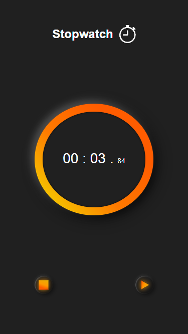

## Table of contents

- [Overview](#overview)
  - [The challenge](#the-challenge)
  - [Screenshot](#screenshot)
  - [Links](#links)
- [My process](#my-process)
  - [Built with](#built-with)
- [Author](#author)

## Overview

### The challenge

Users should be able to:

- View the optimal layout for the site depending on their device's screen size
- Create a stopwatch with play, pause and reset functions

### Screenshot

### Mobile

### Links

- Solution URL: [GitHub](https://github.com/Danielhu3/stopwatch)
- Live Site URL: [Netlify](https://visionary-capybara-103ec5.netlify.app/)

## My process

### Built with

- Semantic HTML5 markup
- CSS custom properties
- Flexbox
- CSS Grid
- Mobile-First workflow
- [React](https://reactjs.org/) - JS library
- [Styled Components](https://styled-components.com/) - For styles
- [TypeScript](https://www.typescriptlang.org/) - Language

## Author
- Frontend Mentor - [@Danielhu3](https://www.frontendmentor.io/profile/Danielhu3)

